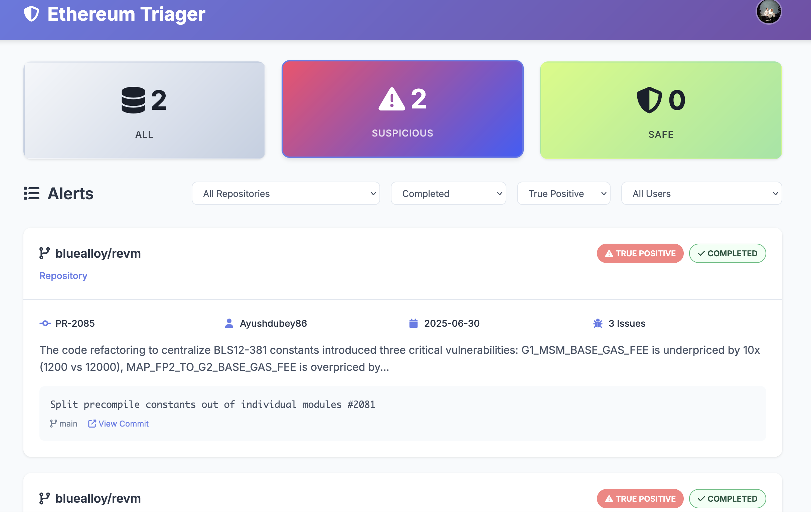

# ECR 

## Capabilities

### Supports many LLM providers
Anthropic, DeepSeek, Gemini, Llama, OpenAI

### Github Action
You can run as a GitHub Action to have it as part of your CI/CD workflow.
https://github.com/marketplace/actions/ethereum-security-reviewer

Create a workflow in your repository, e.g., `.github/workflows/security-review.yml`, use the [security-review.yml.example](security-review.yml.example) file as an example.

Add your API key(s) and other environmental variables to your repository secrets:
  - Go to your repository settings
  - Go to Secrets and Variables > Actions
  - Create a new Repository Secret, with the Name ANTHROPIC_API_KEY and the Secret your Anthropic API key.
  - Create a PR to see it in action. Example output: https://github.com/fredrik0x/go-ethereum/pull/2

### Quick Demo
To view how the tool performs in standalone mode, you can build a docker image.

Create a GitHub Personal Access Token (Classic) with read:repo_hook checked: https://github.com/settings/tokens

Create an Anthropic API key: https://console.anthropic.com/settings/keys

```bash
docker build -t ethereum-code-reviewer:latest .
docker run --rm ethereum-code-reviewer:latest https://github.com/bluealloy/revm/pull/2085 --llm-provider anthropic --anthropic-api-key <anthropic-api-key> --github-token <github-pat-classic>
```

Output should look similar to:
```bash
Analyzing PR #2085
Repository: bluealloy/revm
Initial analysis found 3 potential vulnerabilities. Performing verification...

🛡️ Security Review Report
Vulnerabilities Detected: Yes

Summary:
After verification: 3 confirmed vulnerabilities out of 3 initially found.

Cost Information: $0.108381 (25052 input + 2215 output tokens, claude-sonnet-4-20250514)

Detailed Findings:

HIGH Severity Issue
Description: G1_MSM_BASE_GAS_FEE has been changed from 12000 to 1200, which is a 10x reduction in gas cost for G1 multi-scalar multiplication operations
Recommendation: Revert G1_MSM_BASE_GAS_FEE to 12000 to match EIP-2537 specification
Confidence: 95%

HIGH Severity Issue
Description: MAP_FP2_TO_G2_BASE_GAS_FEE is set to 0x23800 (145408) instead of the expected 23800, representing a ~6x increase in gas cost
Recommendation: Change MAP_FP2_TO_G2_BASE_GAS_FEE from 0x23800 to 23800 to match EIP-2537 specification
Confidence: 90%

MEDIUM Severity Issue
Description: G2_MSM uses incorrect constants - G2_ADD_ADDRESS, G2_ADD_BASE_GAS_FEE, and G2_ADD_INPUT_LENGTH instead of G2_MSM specific constants
Recommendation: Use correct G2_MSM constants instead of G2_ADD constants in g2_msm.rs
Confidence: 85%
::warning::Security vulnerabilities detected with 95% confidence
```

### Dependencies
Python 3.8 or higher

```bash
pip install -e .
```

### Environment Setup

The tool uses flags or environment variables for API keys and configuration. The system prompts are adjusted as environment variables.

1. Using a `.env` file:
   ```bash
   # Copy the example env file
   cp .env.example .env
   
   # Edit .env with your API keys
   GITHUB_TOKEN=your_github_token_here
   ANTHROPIC_API_KEY=your_anthropic_key_here
   OPENAI_API_KEY=your_openai_key_here
   VOYAGE_API_KEY=your_voyage_key_here  # Required for Anthropic with docs
   ...
   ```

2. Setting environment variables directly:
   ```bash
   export GITHUB_TOKEN=your_github_token_here
   export ANTHROPIC_API_KEY=your_anthropic_key_here
   export OPENAI_API_KEY=your_openai_key_here
   export VOYAGE_API_KEY=your_voyage_key_here
   ...
   ```

The tool will automatically load variables from `.env` if present, falling back to system environment variables or flags.


### Multi-judging
If more than one provider is enabled, weighted multi-judging is enabled with voting between providers.
The multi-judge mode:
  - Runs analysis with all available LLMs in parallel
  - Uses weighted voting to determine if vulnerabilities exist
  - If vulnerabilities are detected by consensus, uses Anthropic to synthesize a unified report
  - Provides higher confidence through cross-validation between models
  - Is automatically enabled when using multiple providers (one must be Anthropic)

You can set the weight of each provider by using these variables:
ANTHROPIC_WEIGHT, OPENAI_WEIGHT, GEMINI_WEIGHT, DEEPSEEK_WEIGHT, LLAMA_WEIGHT

### Using Historical Vulnerability or Specification Context

The tool supports using historical vulnerability documentation to improve its analysis through RAG. The embedding providers are:

- OpenAI: Uses text-embedding-3-small model, automatically used with OpenAI's GPT.
- Voyage AI: Required when using Anthropic's Claude with documentation.

1. Create a directory for your vulnerability documentation:
```bash
mkdir docs
```

2. Add your documentation files (supports .md files):
```
docs/
  ├── vuln1.md
  ├── vuln2.md
  └── vuln3.md
```

3. Use the documentation in the analysis:
```bash
# Using Anthropic (requires Voyage AI key)
python -m pr_security_review https://github.com/org/repo/pull/1 \
  --llm-provider anthropic \
  --docs-dir ./docs \
  --voyage-api-key your_voyage_api_key

# Using OpenAI (automatically uses OpenAI embeddings)
python -m pr_security_review https://github.com/org/repo/pull/1 \
  --llm-provider openai \
  --docs-dir ./docs
```

This will then:
1. Generate embeddings for your documentation (cached for reuse)
2. Find relevant context for each PR analysis using vector similarity
3. Include this context in the security review


### CLI

One-Shot examples using Anthropic

<a href="images/cli.png">
  
</a>

#### Single PR Review

```bash
# Using environment variables
export GITHUB_TOKEN=your_github_personal_access_token
export ANTHROPIC_API_KEY=your_anthropic_key
python -m pr_security_review https://github.com/org/repo/pull/1

# Optionally post results as a PR comment
python -m pr_security_review https://github.com/org/repo/pull/1 --post-comment

# With vulnerability documentation (requires Voyage AI)
export VOYAGE_API_KEY=your_voyage_key
python -m pr_security_review https://github.com/org/repo/pull/1 \
  --docs-dir ./docs

# Or using command line arguments
python -m pr_security_review https://github.com/org/repo/pull/1 \
  --github-token your_github_token \
  --llm-provider anthropic \
  --anthropic-api-key your_anthropic_key \
  --model claude-sonnet-4-20250514 \  # optional
  --docs-dir ./docs \   # optional
  --voyage-api-key your_voyage_key        # required if using docs-dir
```

#### Analyzing Recent PRs

You can also analyze the last X PRs from a repository to get a broader security overview:

```bash
# Analyze the last 10 PRs from a repository (default)
python -m pr_security_review --recent-prs owner/repo

# Analyze the last 5 PRs from a repository
python -m pr_security_review --recent-prs owner/repo --pr-count 5

# With specific LLM provider and API key
python -m pr_security_review --recent-prs owner/repo \
  --pr-count 15 \
  --llm-provider openai \
  --openai-api-key YOUR_KEY \
  --github-token YOUR_GITHUB_TOKEN
```

This feature is particularly useful for:
- Security audits of recent changes
- Identifying patterns in security issues across PRs
- Bulk analysis of repositories
- Getting a security overview before releases

The tool will:
1. Fetch the last X PRs from the repository (both open and closed)
2. Analyze each PR with code changes for security vulnerabilities
3. Provide a summary report showing which PRs have security issues
4. Display total cost information for the batch analysis

#### Single File Analysis

You can analyze individual files:

```bash
# Analyze a specific file
python -m pr_security_review --file https://github.com/org/repo/blob/main/src/auth.py
```

#### Single Commit Analysis

You can also analyze individual commits:

```bash
# Analyze a specific commit
python -m pr_security_review --repository NethermindEth/Nethermind --analyze-commit <SHA>
```

#### Monitor

You can use the commit monitoring feature that track repositories for new commits and automatically analyze them for security vulnerabilities.

##### Add repositories manually

```bash
# Add a repository to monitor (e.g., Nethermind's master branch)
python -m pr_security_review --monitor-add https://github.com/NethermindEth/nethermind --monitor-branches master

# Check for new commits once
python -m pr_security_review --monitor-check

# Start continuous monitoring (checks every 5 minutes by default)
python -m pr_security_review --monitor-continuous
```

#### Common Commands

```bash
# List all monitored repositories
python -m pr_security_review --monitor-list

# Remove a repository from monitoring
python -m pr_security_review --monitor-remove https://github.com/NethermindEth/nethermind

# Analyze a specific commit
python -m pr_security_review --analyze-commit abc123 --repository owner/repo

# Continuous monitoring with custom interval (in seconds)
python -m pr_security_review --monitor-continuous --monitor-interval 600
```

### Message Queue
You can use a supported AMQP queue (such as rabbitmq) to receive incoming review requests, and to submit results. Use the AMQP_URL, QUEUE_NAME and RESPONSE_QUEUE_NAME to set this up.


### GitHub Application
You can also run the tool as a GitHub App, which allows for command-based triggering of security reviews on PRs.
Example: https://github.com/fredrik0x/go-ethereum/pull/1

<a href="images/github.png">
  
</a>


1. Create a new GitHub App:
   - Go to your GitHub Settings > Developer settings > GitHub Apps
   - Click "New GitHub App"
   - Fill in the required information:
     - Name: Choose a name for your app
     - Homepage URL: Your repository URL
     - Webhook URL: The URL where your app will be running
     - Webhook secret: Generate a secure random string

2. Set Repository Permissions:
   - Pull requests: Read & write (for reading PR changes and posting comments)
   - Repository contents: Read (for accessing code)
   - Repository collaborators: Read (for checking user permissions)

3. Subscribe to Events:
   - Pull request (for automatic analysis of new PRs)
   - Issue comment (for command-based triggering)

4. After creating the app:
   - Note down the App ID
   - Generate and download a private key
   - Install the app on your repositories

5. Run the app as a webhook server (or use Dockerfile.github):
```bash
python -m pr_security_review \
  --github-app \
  --github-app-id YOUR_APP_ID \
  --github-private-key-path path/to/private-key.pem \
  --github-webhook-secret YOUR_WEBHOOK_SECRET \
  --llm-provider openai \  # or anthropic
  --openai-api-key YOUR_OPENAI_KEY \  # or --anthropic-api-key for Anthropic
  --docs-dir ./docs \  # optional
  --voyage-api-key YOUR_VOYAGE_KEY  # required if using Anthropic with docs
```

The app will now:
- Automatically analyze new PRs and PR updates
- Allow repository admins/maintainers to trigger analysis by commenting `/security-review` on any PR


### Web Application
<a href="images/web1.png">
  
</a>

<a href="images/web2.png">
  
</a>


<a href="images/web3.png">
  
</a>


To run the application in web server mode, you must at a minimum set the following flags or environment variables:
```bash
GITHUB_TOKEN=
ANTHROPIC_API_KEY=
GOOGLE_CLIENT_ID=
FLASK_SECRET_KEY=
AUTHORIZED_EMAILS=the.google.email.address.you.want.to.be.admin
WEB_APP_PORT=
BASE_URL=
```

#### Email Notifications

You can receive an email whenever a new finding is found by setting the AWS SES environmental variables.

#### Telegram Notifications

<a href="images/telegram.png">
  
</a>

You can receive telegram notifications when a review has found a potential vulnerability (or all reviews)

```bash
# Configure Telegram notifications in the .env file with findings web server
TELEGRAM_BOT_TOKEN=your_telegram_bot_token
TELEGRAM_CHAT_ID=your_telegram_chat_id
FINDINGS_SERVER_URL=https://your-server-url.com  # Optional: defaults to localhost if not set
FINDINGS_SERVER_PORT=8000  # Optional: defaults to 8000
NOTIFY_CLEAN_COMMITS=true  # Optional: notify for clean commits with no vulnerabilities

# Start monitoring with Telegram notifications
python -m pr_security_review --monitor-continuous
```

This will:
1. Start a findings server that hosts detailed vulnerability reports
2. Send concise summaries to Telegram with links to detailed reports
3. Each link contains comprehensive information about the vulnerability, including:
   - Detailed explanations of the issue
   - Impact analysis
   - Fix recommendations with code examples
   - Additional resources when available
4. Enable Telegram bot commands:
   - `/lastcommits` - Shows the latest commits for each monitored repository
   - `/listrepos` - Lists all repositories currently being monitored
5. Optionally sends notifications for clean commits (commits with no security vulnerabilities)

The `/lastcommits` command provides a quick overview of the most recent commit in each branch of monitored repositories, including:
- Repository name and branch
- Commit hash with link to GitHub
- Author name
- Commit date and time
- Commit message snippet

The `/listrepos` command shows a simple list of all repositories being monitored, including:
- Repository name
- Monitored branches

When the `--notify-clean-commits` flag is enabled (or `NOTIFY_CLEAN_COMMITS=true` environment variable is set), you'll also receive notifications for commits that have been analyzed and found to have no security vulnerabilities. These "clean commit" notifications include:
- Repository name and branch
- Commit hash with link to GitHub
- Author name 
- Commit message


### Database Management

You can use this database utility to managing your security findings:

```bash
# Check database connection
python -m pr_security_review.db_utils check

# View database statistics
python -m pr_security_review.db_utils stats

# Clean up expired findings
python -m pr_security_review.db_utils cleanup

# List recent findings for a repository
python -m pr_security_review.db_utils list --repo ethereum/go-ethereum

# View details of a specific finding
python -m pr_security_review.db_utils details <uuid>
```

## License

MIT License - see LICENSE file for details.
